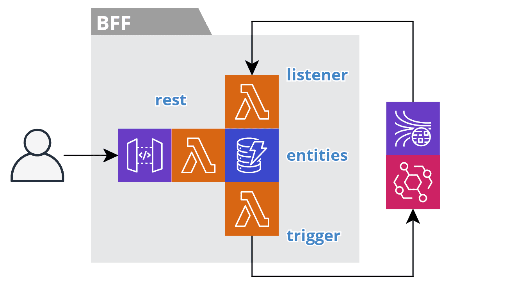

# template-bff-service

## Getting Started With This Template

You can use the Serverless Framework to create a new project from this template.

First, install `serverless` globally:

`npm install serverless -g`

Then create a new project:

`sls create --template-url https://github.com/jgilbert01/templates/tree/master/template-bff-service --path <subsys>-<xyz>-service`

Then name

  org: my
  subsys: template

rename model entities such as thing

remove, sych as job